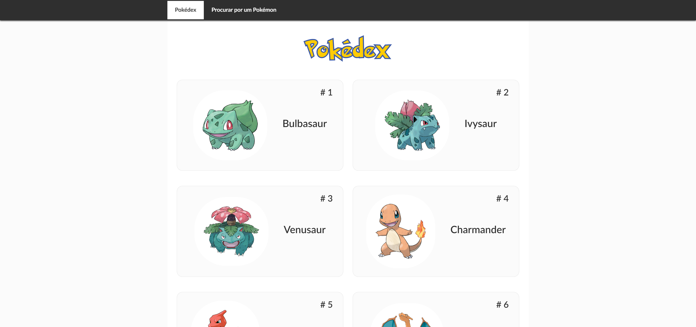
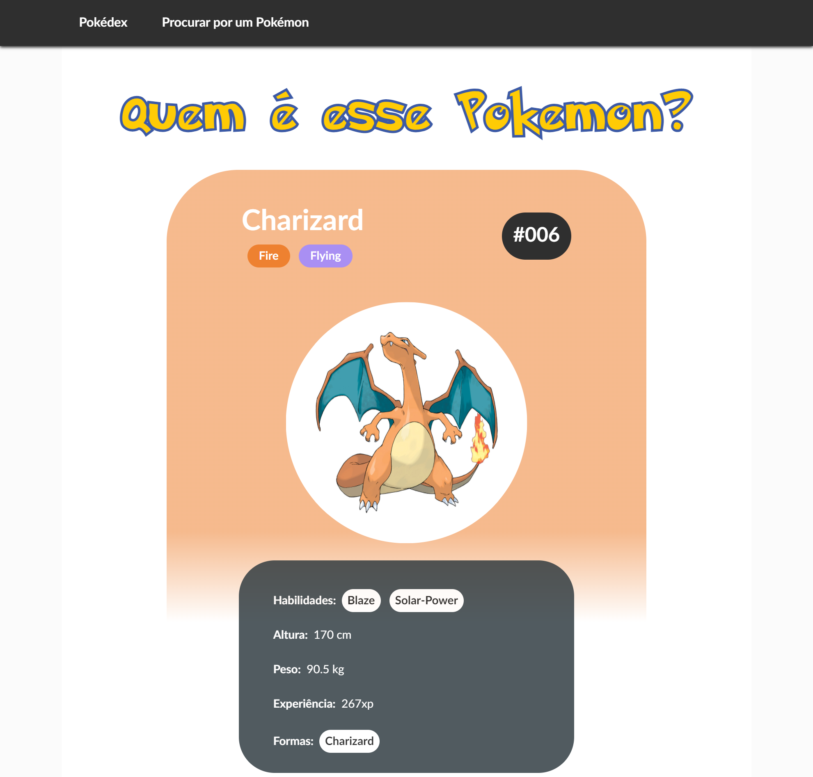

<h1 align="center">Reactdex - Uma Pokédex construída com ReactJS</h1>
<p align="center">
  
  <br>
  <i>Este webApp é um exemplo de aplicativo que pode ser construído com o 
    <br>framework JavaScript ReactJS.</i>
  <br>
</p>

<p align="center">
  <a href="https://nothingnothings.github.io/pokemonapi"><strong>https://nothingnothings.github.io/pokemonapi</strong></a>
  <br>
</p>


## Introdução







Single Page Application (SPA) construída com a library/framework ReactJS (create-react-app). O design do app foi inspirado pelo site [https://pokeapi.co](https://pokeapi.co). Bootstrap, Flexbox e media queries foram utilizados na construção do design responsivo (tentativa de fornecer a melhor experiência possível a múltiplas configurações de tela/dispositivos, tanto desktop como mobile, com diferentes resoluções). Seguindo as ultimas orientações/versões da library React, o app foi constituído através do uso de functional components, distanciando-se do approach class-based ("`class App extends React.Component{}`") usado no passado. 

O app foi inicializado/bootstrapped com o comando/environment `create-react-app` e implantado (deploy) com o GitHub Pages, assistido pelo recurso GitHub Actions.


 
## Tecnologias
 
 Algumas das linguagens e libraries empregadas:
 
 - Node Package Manager (bootstrapping e gerenciamento do aplicativo React)
 - HTML5 (com JSX, por conta do React)
 - CSS3 (animações, Flexbox, media queries)
 - JavaScript "vanilla", para o setup de uma Single-Page Application no GitHub Pages (script posicionado no `<head>` do arquivo `index.html`)
 - ReactJS (library/framework JavaScript, app composto inteiramente por React components)
 - Typescript (para a type safety dos objetos recebidos pelos endpoints do backend, Models e Interfaces, etc.)
 - React Router (para a navegação entre as diferentes "páginas" do aplicativo)
 - Manage local de state (dois states principais: o central, em "App.js", usado nas páginas "Pokedex" e "Procurar por um Pokémon", e o relativo aos pokémons indivíduais,  localizado na página "PokemonDetails", acessada pela route "/pokedex/:idDoPokemon")
 - Bootstrap (usado na barra de navegação e no posicionamento geral dos elementos na página, com "container", "row" e "col")
 - Axios (para a comunicação, requests e responses, entre este aplicativo frontend e o backend visado/buscado por ele, os API endpoints disponibilizados pelo domínio "pokeapi.co")
 
 
## Estrutura de Diretórios do Projeto

O ambiente de desenvolvimento (com utilização da ferramenta/environment/worfklow `create-react-app`):


```

.\
│
├── .github\
│   │
│   └── workflows\
│       └── publish.yml
│
│
├── public\
│   │
│   ├── fonts\
│   │   └── Pokemon Solid.ttf
│   │
│   ├── 404.html
│   ├── favicon-16x16.png
│   ├── favicon-32x32.png
│   ├── favicon.ico
│   ├── index.html
│   ├── logo192.png
│   ├── logo512.png
│   └── manifest.json
│
├── snapshot\
│   ├── Reactdex1.png
│   └── Reactdex2.png
│
├── src\
│   │
│   ├── components\
│   │   │
│   │   ├── Card\
│   │   │   ├── Card.css
│   │   │   └── Card.tsx
│   │   │
│   │   ├── ErrorComponent\
│   │   │   ├── ErrorComponent.css
│   │   │   └── ErrorComponent.tsx
│   │   │
│   │   ├── PokeSearch\
│   │   │   └── PokeSearch.tsx
│   │   │
│   │   ├── Pokedex\
│   │   │   ├── Pokedex.css
│   │   │   └── Pokedex.tsx
│   │   │
│   │   ├── PokemonDetailsCard\
│   │   │   ├── PokemonDetailsCard.css
│   │   │   └── PokemonDetailsCard.tsx
│   │   │
│   │   ├── UI\
│   │   │   │
│   │   │   ├── PokeBall\
│   │   │   │   ├── Pokeball.css
│   │   │   │   └── Pokeball.tsx
│   │   │   │
│   │   │   ├── Spinner\
│   │   │   │   └── Spinner.tsx
│   │   │   │
│   │   │   └── Toolbar\
│   │   │       │
│   │   │       ├── MainNavigation\
│   │   │       │   │
│   │   │       │   ├── NavigationItems\
│   │   │       │   │   │
│   │   │       │   │   ├── NavigationItem\
│   │   │       │   │   │   ├── NavigationItem.css
│   │   │       │   │   │   └── NavigationItem.tsx
│   │   │       │   │   │
│   │   │       │   │   ├── NavigationItems.css
│   │   │       │   │   └── NavigationItems.tsx
│   │   │       │   │
│   │   │       │   ├── MainNavigation.css
│   │   │       │   └── MainNavigation.tsx
│   │   │       │
│   │   │       ├── Toolbar.css
│   │   │       └── Toolbar.tsx
│   │   │
│   │   │
│   │   ├── Utility\
│   │   │   │
│   │   │   └── ScrollToTop\
│   │   │       └── ScrollToTop.tsx
│   │   │
│   │   │
│   │   └── hocs\
│   │       │
│   │       ├── Layout\
│   │       │   └── Layout.tsx
│   │       │
│   │       └── PokedexWrapper\
│   │           ├── PokedexWrapper.css
│   │           └── PokedexWrapper.tsx
│   │
│   │
│   │
│   ├── models\
│   │   ├── pokemon.model.ts
│   │   └── simplepokemon.model.ts
│   │
│   ├── pages\
│   │   │
│   │   ├── PokedexPage\
│   │   │   └── PokedexPage.tsx
│   │   │
│   │   ├── PokemonDetails\
│   │   │   └── PokemonDetails.tsx
│   │   │
│   │   └── PokemonSearch\
│   │       └── PokemonSearch.tsx
│   │
│   │
│   ├── App.tsx
│   ├── index.css
│   ├── index.tsx
│   └── logo.svg
│
├── README.md
├── package-lock.json
├── package.json
├── react-app-env.d.ts
└── tsconfig.json
```


O output de production de `create-react-app`, que pode ser visualizado no branch`gh-pages` (encarregado da implementação/deployment do app):


```
.\
│
├── fonts\
│   └── Pokemon Solid.ttf
│
├── static\
│   │
│   ├── css\
│   │   ├── main.d8663289.css
│   │   └── main.d8663289.css.map
│   │
│   ├── js\
│   │   ├── main.006563d5.js
│   │   ├── main.006563d5.js.LICENSE.txt
│   │   └── main.006563d5.js.map
│   │
│   └── media\
│       └── Pokemon Solid.5d60be1f7ff5fcc21fc1.ttf
│
│
├── .nojekyll
├── 404.html
├── asset-manifest.json
├── favicon-16x16.png
├── favicon-32x32.png
├── favicon.ico
├── index.html
├── logo192.png
├── logo512.png
└── manifest.json
```


## Arquivos de Configuração do Projeto (package.json e tsconfig.json)

The package.json file used in the project:

```
{
  "name": "node-shop-rest-api",
  "version": "0.2.0",
  "private": true,
  "homepage": "https://nothingnothings.github.io/NodeShopRestAPI",
  "dependencies": {
    "@fortawesome/free-regular-svg-icons": "^6.1.2",
    "@fortawesome/free-solid-svg-icons": "^6.1.2",
    "@fortawesome/react-fontawesome": "^0.2.0",
    "@reduxjs/toolkit": "^1.8.3",
    "@testing-library/jest-dom": "^5.16.4",
    "@testing-library/react": "^13.3.0",
    "@testing-library/user-event": "^13.5.0",
    "@types/react-fontawesome": "^1.6.5",
    "axios": "^0.27.2",
    "bootstrap": "^5.2.0",
    "font-awesome": "^4.7.0",
    "react": "^18.2.0",
    "react-bootstrap": "^2.4.0",
    "react-dom": "^18.2.0",
    "react-redux": "^8.0.2",
    "react-router-dom": "^6.3.0",
    "react-scripts": "5.0.1",
    "react-stripe-checkout": "^2.6.3",
    "redux": "^4.2.0",
    "redux-thunk": "^2.4.1",
    "web-vitals": "^2.1.4"
  },
  "scripts": {
    "start": "react-scripts start",
    "build": "react-scripts build",
    "test": "react-scripts test",
    "eject": "react-scripts eject"
  },
  "eslintConfig": {
    "extends": [
      "react-app",
      "react-app/jest"
    ]
  },
  "browserslist": {
    "production": [
      ">0.2%",
      "not dead",
      "not op_mini all"
    ],
    "development": [
      "last 1 chrome version",
      "last 1 firefox version",
      "last 1 safari version"
    ]
  },
  "devDependencies": {
    "@types/react": "^18.0.15",
    "gh-pages": "^4.0.0"
  }
}
```

## Instalação/Utilização 


Para usar este projeto, clone-o usando Git:

1. Run `git clone` to clone the project into your local Git repository
2. Run `npm install` to install all dependencies (`react`, `axios`, etc)
3. Run `npm run build` to create the production/deployment version of the app (outputted in `/build`)
4. Serve the production files locally or on the web, with the help of a hosting provider (although great part of the app relies/depends on the backend's data, which in the case of this demo, is served by a Node.js (Express.js) server, hosted on Heroku)
5. For the purposes of this demo, on the "Get Started" (Authentication) page, input the credentials `exemplo@exemplo.com` (email) and `exemplo` (password) to access the apps's various features


## Destaques (features)

- Single-Page Application, no page reloads, single HTML file (ReactJS)
- Application divided into many components, of which some are used more than a single time, on different pages (ReactJS design philosophy)
- Hexagon-inspired design, created with CSS
- CSS-animated SVG logo on landing page
- Form validation logic using the `useState` Hook, as seen in the 'Get Started' and 'Add a Product' pages.
- Responsive design (adaptive, mobile and desktop support) created with Flexbox and media queries
- Usage of GitHub Actions and GitHub Pages with the `create-react-app` utility for a seamless workflow (transition from development stage to production/deployment stage). Upon the git push command, GitHub Actions transfers the contents of the master branch into the gh-pages branch, which then deploys the app at https://nothingnothings.github.io/NodeShopRestAPI/.
- For deployment demonstration purposes, only a single user is enabled/created on the serverside, with the credentials `exemplo@exemplo.com` (email field) and `exemplo` (password field). Creation of additional users ("No account? Join NodeShop") is possible in the complete app (in this demo app, the account creation endpoints are disabled). Furthermore, the "Orders" made by the user are reset every 60 minutes (MongoDB Time to Live Index feature), and the products added to the "Cart", every 8 hours (MongoDB "Scheduled Trigger" feature)
- Working "Shopping Cart" feature ("Add" and "Remove" products feature, with interactive "number of items" icon, synchronized with the global Redux state), implemented with `react-redux`
- Form validation logic, powered by ReactJS's state management, in the "Get Started" page
- Simple pagination logic for the list of products
- Page redirection, made possible by the usage of React Router
- Usage of Axios for communication with the Node.js (Express.js) backend, which manages the "User", "Product", "Order" and "Cart" objects, stored on a MongoDB database (MongoDB Atlas service); the Node.js server and MongoDB database also handle the authentication logic (login/signup) implemented on the app
- Dummy representation of the possible integration of shop apps with Stripe, with the `react-stripe-checkout` package and corresponding serverside logic producing effects on the frontend (page redirection and visual update of "orders" page)
- Animated custom "Loading..." Spinner
- Viewing of each order's invoices/faturas in .pdf files, produced by the backend (`pdfkit` package)
- Font Awesome and Bootstrap usage (in the Footer component)
- Custom favicon, compatible with multiple devices

