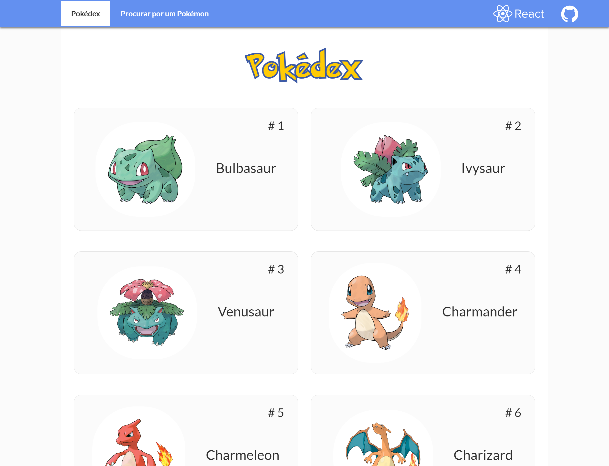

<h1 align="center">ReactDex - OceanBlue - A Pokédex Built with ReactJS</h1>
<p align="center">
  
  <br>
  <i>This web app is an example of an application that can be built using the 
    <br>JavaScript framework ReactJS.</i>
  <br>
</p>

<p align="center">
  <a href="https://nothingnothings.github.io/ReactDex" target="_blank" rel="noreferrer noopener"><strong>https://nothingnothings.github.io/ReactDex</strong></a>
  <br>
</p>


## Introduction




Single Page Application (SPA) built with the ReactJS library/framework (create-react-app). The app's design was inspired by the website [https://pokeapi.co](https://pokeapi.co). Bootstrap, Flexbox, and media queries were used to create a responsive design (aiming to provide the best possible experience across multiple screen configurations/devices, both desktop and mobile, with varying resolutions). Following the latest guidelines/versions of the React library, the app was built using functional components, moving away from the class-based approach ("`class App extends React.Component{}`") used in the past.

The app was initialized/bootstrapped with the `create-react-app` command/environment and deployed with GitHub Pages, assisted by GitHub Actions.


[](http://hits.dwyl.com/nothingnothings/ReactDex)
[](https://github.com/nothingnothings/ReactDex)
[](https://github.com/nothingnothings/ReactDex/blob/master/README.pt-br.md)


 
## Technologies
 
Some of the languages and libraries that were used:
 
- Node Package Manager (bootstrapping and managing the React application)
- HTML5 (with JSX, due to React)
- CSS3 (animations, Flexbox, media queries)
- Vanilla JavaScript for setting up a Single Page Application on GitHub Pages (script placed in the `<head>` of the `index.html` file)
- ReactJS (JavaScript library/framework, app composed entirely of React components)
- TypeScript (for type safety of objects received from backend endpoints, models, and interfaces, etc.)
- React Router (for navigation between the different "pages" of the app)
- Local state management (two main states: the central one in "App.js", used in the "Pokedex" and "Search for a Pokémon" pages, and the individual Pokémon state located in the "PokemonDetails" page, accessed via the route "/pokedex/:pokemonId")
- Bootstrap (used in the navigation bar and for overall positioning of elements on the page, with "container," "row," and "col")
- Axios (for communication, requests, and responses between this frontend application and the targeted backend API endpoints provided by the domain "pokeapi.co")
 
 
## Project Directory Structure

The development environment (created by using the `create-react-app` tool/environment/workflow):


```

.\
│
├── .github\
│   │
│   └── workflows\
│       └── publish.yml
│
│
├── public\
│   │
│   ├── fonts\
│   │   └── Pokemon Solid.ttf
│   │
│   ├── 404.html
│   ├── favicon-16x16.png
│   ├── favicon-32x32.png
│   ├── favicon.ico
│   ├── index.html
│   ├── logo192.png
│   ├── logo512.png
│   └── manifest.json
│
├── snapshot\
│   ├── Reactdex1.png
│   └── Reactdex2.png
│
├── src\
│   │
│   ├── components\
│   │   │
│   │   ├── Card\
│   │   │   ├── Card.css
│   │   │   └── Card.tsx
│   │   │
│   │   ├── ErrorComponent\
│   │   │   ├── ErrorComponent.css
│   │   │   └── ErrorComponent.tsx
│   │   │
│   │   ├── PokeSearch\
│   │   │   └── PokeSearch.tsx
│   │   │
│   │   ├── Pokedex\
│   │   │   ├── Pokedex.css
│   │   │   └── Pokedex.tsx
│   │   │
│   │   ├── PokemonDetailsCard\
│   │   │   ├── PokemonDetailsCard.css
│   │   │   └── PokemonDetailsCard.tsx
│   │   │
│   │   ├── UI\
│   │   │   │
│   │   │   ├── PokeBall\
│   │   │   │   ├── Pokeball.css
│   │   │   │   └── Pokeball.tsx
│   │   │   │
│   │   │   ├── Spinner\
│   │   │   │   └── Spinner.tsx
│   │   │   │
│   │   │   └── Toolbar\
│   │   │       │
│   │   │       ├── MainNavigation\
│   │   │       │   │
│   │   │       │   ├── NavigationItems\
│   │   │       │   │   │
│   │   │       │   │   ├── NavigationItem\
│   │   │       │   │   │   ├── NavigationItem.css
│   │   │       │   │   │   └── NavigationItem.tsx
│   │   │       │   │   │
│   │   │       │   │   ├── NavigationItems.css
│   │   │       │   │   └── NavigationItems.tsx
│   │   │       │   │
│   │   │       │   ├── MainNavigation.css
│   │   │       │   └── MainNavigation.tsx
│   │   │       │
│   │   │       ├── Toolbar.css
│   │   │       └── Toolbar.tsx
│   │   │
│   │   │
│   │   ├── Utility\
│   │   │   │
│   │   │   └── ScrollToTop\
│   │   │       └── ScrollToTop.tsx
│   │   │
│   │   │
│   │   └── hocs\
│   │       │
│   │       ├── Layout\
│   │       │   └── Layout.tsx
│   │       │
│   │       └── PokedexWrapper\
│   │           ├── PokedexWrapper.css
│   │           └── PokedexWrapper.tsx
│   │
│   │
│   │
│   ├── models\
│   │   ├── pokemon.model.ts
│   │   └── simplepokemon.model.ts
│   │
│   ├── pages\
│   │   │
│   │   ├── PokedexPage\
│   │   │   └── PokedexPage.tsx
│   │   │
│   │   ├── PokemonDetails\
│   │   │   └── PokemonDetails.tsx
│   │   │
│   │   └── PokemonSearch\
│   │       └── PokemonSearch.tsx
│   │
│   │
│   ├── App.tsx
│   ├── index.css
│   ├── index.tsx
│   └── logo.svg
│
├── README.md
├── README.pt-br.md
├── package-lock.json
├── package.json
├── react-app-env.d.ts
└── tsconfig.json
```


The production output of `create-react-app`, which can be viewed in the `gh-pages` branch (responsible for deploying the app):


```
.\
│
├── fonts\
│   └── Pokemon Solid.ttf
│
├── static\
│   │
│   ├── css\
│   │   ├── main.d8663289.css
│   │   └── main.d8663289.css.map
│   │
│   ├── js\
│   │   ├── main.006563d5.js
│   │   ├── main.006563d5.js.LICENSE.txt
│   │   └── main.006563d5.js.map
│   │
│   └── media\
│       └── Pokemon Solid.5d60be1f7ff5fcc21fc1.ttf
│
│
├── .nojekyll
├── 404.html
├── asset-manifest.json
├── favicon-16x16.png
├── favicon-32x32.png
├── favicon.ico
├── index.html
├── logo192.png
├── logo512.png
└── manifest.json
```


## Project Configuration Files (package.json and tsconfig.json)


The `package.json` file used in the project:

```
{
  "name": "projeto-pokemon",
  "version": "0.1.0",
  "private": true,
  "homepage": "https://nothingnothings.github.io/pokemonapi",
  "dependencies": {
    "@testing-library/jest-dom": "^5.16.5",
    "@testing-library/react": "^13.4.0",
    "@testing-library/user-event": "^13.5.0",
    "@types/jest": "^29.2.0",
    "@types/node": "^18.11.3",
    "@types/react": "^18.0.21",
    "@types/react-dom": "^18.0.6",
    "axios": "^1.1.3",
    "gh-pages": "^4.0.0",
    "react": "^18.2.0",
    "react-dom": "^18.2.0",
    "react-router-dom": "^6.4.2",
    "react-scripts": "5.0.1",
    "typescript": "^4.8.4",
    "web-vitals": "^2.1.4"
  },
  "scripts": {
    "start": "react-scripts start",
    "build": "react-scripts build",
    "test": "react-scripts test",
    "eject": "react-scripts eject"
  },
  "eslintConfig": {
    "extends": [
      "react-app",
      "react-app/jest"
    ]
  },
  "browserslist": {
    "production": [
      ">0.2%",
      "not dead",
      "not op_mini all"
    ],
    "development": [
      "last 1 chrome version",
      "last 1 firefox version",
      "last 1 safari version"
    ]
  }
}
```


The tsconfig.json file used in the project:


```

{
  "compilerOptions": {
    "target": "es5",
    "lib": [
      "dom",
      "dom.iterable",
      "esnext"
    ],
    "allowJs": true,
    "skipLibCheck": true,
    "esModuleInterop": true,
    "allowSyntheticDefaultImports": true,
    "strict": true,
    "forceConsistentCasingInFileNames": true,
    "noFallthroughCasesInSwitch": true,
    "module": "esnext",
    "moduleResolution": "node",
    "resolveJsonModule": true,
    "isolatedModules": true,
    "noEmit": true,
    "jsx": "react-jsx"
  },
  "include": [
    "src"
  ]
}

```

## Installation/Usage


To use this project, clone it using Git:

1. Run `git clone` to clone the project into your local Git repository.
2. Run `npm install` to install all dependencies (`react`, `axios`, etc.).
3. Run `npm run build` to create the production/deployment version of the application (outputted in the `/build` directory).
4. Serve the production/deployment files locally or on the web (with the help of a hosting service).
5. On the "Pokédex" page, click/tap on the Pokémon whose characteristics you want to view. On the "Search for a Pokémon" page, type the name of the Pokémon you want to search for.


## Features

- Single-page application with no page reloads, using a single HTML file (ReactJS).
- Application divided into various components, some of which are reused across different pages (design philosophy of the ReactJS library).
- Custom CSS design.
- Responsive design (adaptive, supporting mobile and desktop devices) created with Bootstrap, Flexbox, and media queries.
- GitHub Actions and GitHub Pages usage with the `create-react-app` tool to build a seamless workflow (transitioning from development to production/deployment). With the `git push` command, GitHub Actions transfers the content from the `master` branch to the `gh-pages` branch, which then deploys the app at https://nothingnothings.github.io/ReactDex/.
- Usage of the Axios package/tool for communication with the backend "pokeapi.co," which provides Pokémon data (names, IDs, weight, height, types, abilities, etc.) to the React app.
- Utilization of core features of the ReactJS library, such as the hooks `useState()` and `useEffect()`.
- Custom loading spinner (Pokéball).
- Custom error page that outputs the error message/reason to the user.
- Favicon compatible with various devices.

